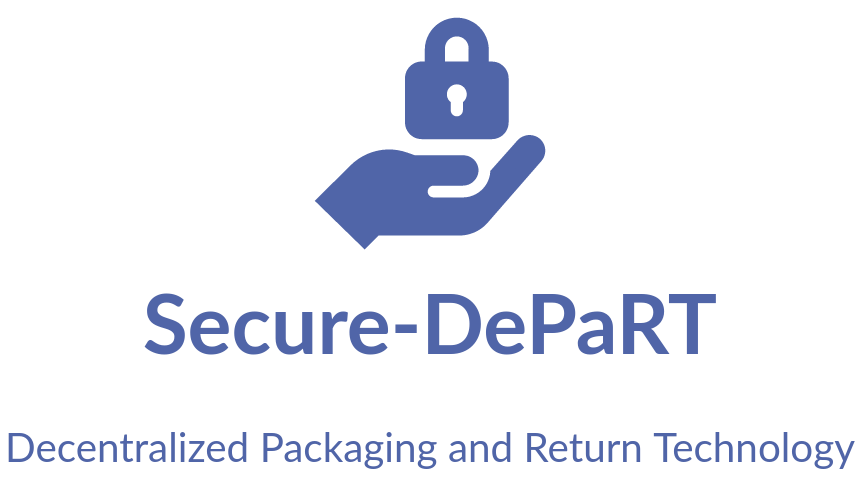
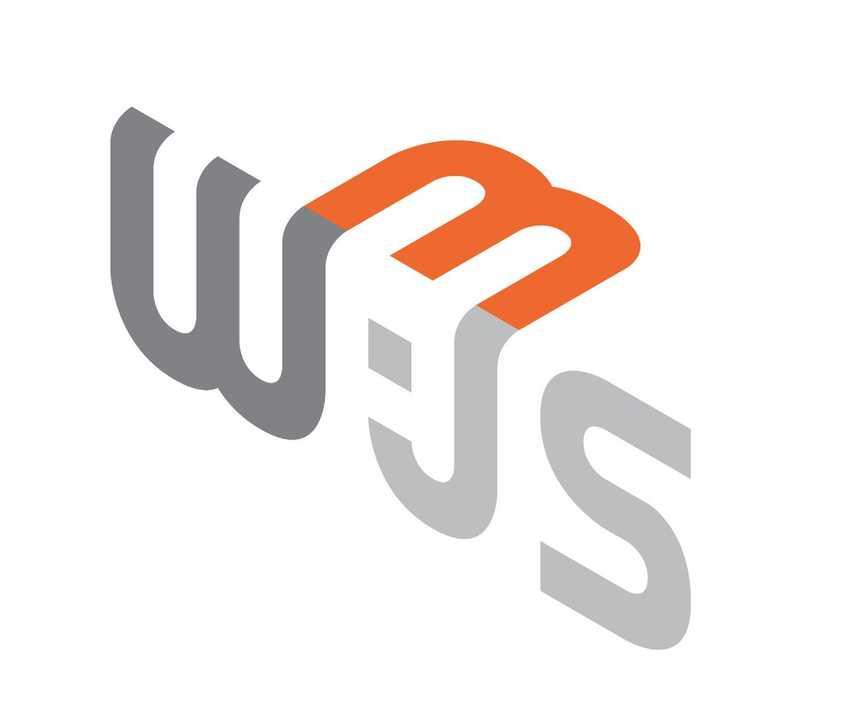
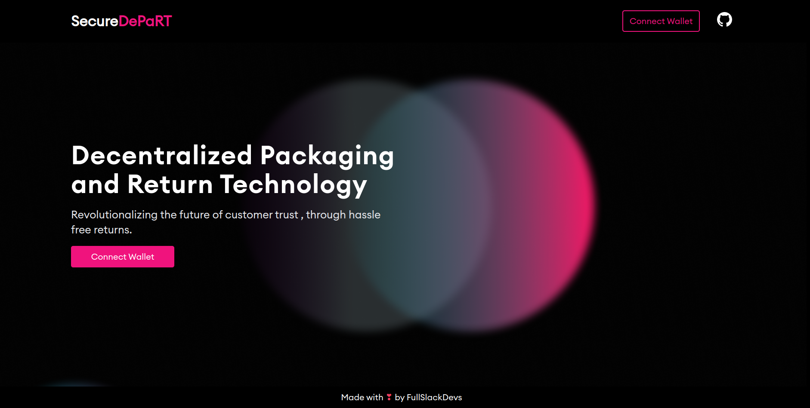
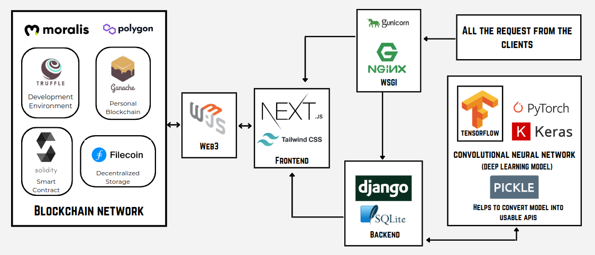
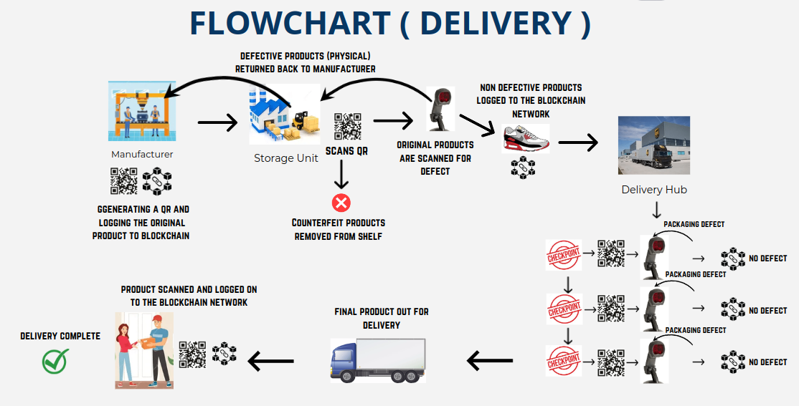
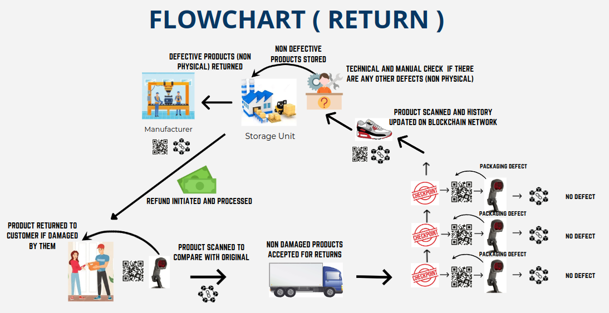
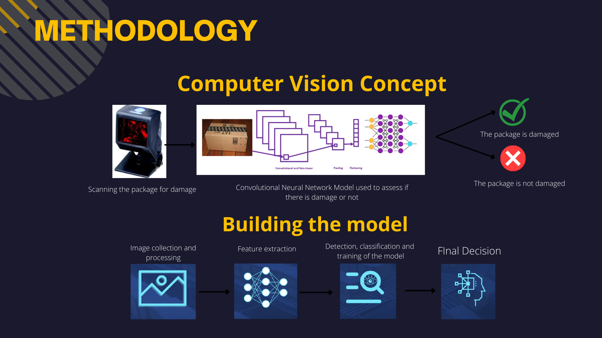

<h1 align="center">
  <br>
  <a></a>
  <br>  
</h1>

<p align="center">
  <a href="https://hardhat.org/">
    
  </a>
  <a href="https://soliditylang.org/">
           
  </a>
    <a href="https://www.npmjs.com/package/web3">
    
  </a>
  &nbsp;&nbsp;&nbsp;
  <a href="https://nextjs.org/"></a>
    &nbsp;&nbsp;&nbsp;
  <a href="https://tailwindcss.com/">
           
  </a>
  &nbsp;&nbsp;&nbsp;
  <a href="https://www.tensorflow.org/"></a>
  &nbsp;&nbsp;&nbsp;
  <a href="https://keras.io/">
  
  </a>
</p>
<p align="center">
  <a href="https://www.djangoproject.com/">
    
  </a>
</p>

<p align="center">
  <a >
    
  </a>
  <a href="https://github.com/rishav4101/eth-supplychain-dapp/issues"></a>
  <a href="https://opensource.org/licenses/MIT">
    
  </a>
</p>

<p align="center">
  <a href="#description">Description</a> •
  <a href="#architecture">Architecture</a> •
  <a href="#flow">Flow</a> •
  <a href="#working">Working</a> •
  <a href="#installation-and-setup">Installation and Setup</a> •
  <a href="#license">License</a>
</p>

## Description
 <br/>
It is a DApp (Decentralized Application) coupled with Computer Vision (Convolutional Neural Network, a form of Deep Learning) to build customer trust. Computer vision ensures that the product is not damaged before or during transit. This system will contain the history of the product starting from the manufacturer and ending with the customer, all logged onto the blockchain network which is secure and transparent, avoiding the entry of counterfeit or damaged products.
<br/>
<br/>
<br/>
<center>
 
 </center>

<p align="right">(<a href="#top">back to top</a>)</p>

## Architecture
<p align="centre">  
      
</p>

<p align="right">(<a href="#top">back to top</a>)</p>

## Flow
<p align="centre">  
     
  <br/> 
   <br/> 
    <br/> 
       
</p>

<p align="right">(<a href="#top">back to top</a>)</p>

## Working

<p>
  The lifecycle of a product starts when <strong>the product is scanned</strong> and logged into the blockchain network by the manufacturer.
</p>
<p>
 At every stage of the delivery, the packaged product is scanned to check if it is damaged, this is done using <strong>Computer Vision</strong> by training the model with a large number of images of various packaged goods. The product history's next stage is updated on the blockchain, only if the package is deemed not damaged after scanning, or else it is repackaged.
</p>
<p>
 Hassle-free refunds and returns can be handled by scanning the product before return and comparing it with the initially scanned product before packaging, if they are deemed to be the same, the return process is initiated and the product history is continued on the blockchain network in the reverse order. This prevents manipulation or manual destruction of the product on the customer's part and helps in easy returns. 
</p>

### Machine Learning

The model is trained using Tensorflow and Keras and is a Convolutional Neural Network (CNN) model comprising of 3 layers.The first layer performs the Image Extraction, the second layer performs the reduction of Image Dimensions and the final layer which is similar to an ANN(Aritificial Neural Network) and returns the final prediction. The final predicition when posted to a an API endpoint particular route returns true or false,based on the nature of the package or product(intact or damaged).
<br/>
<br/>


 


### Blockchain

Solidity Smart Contracts have been used to assign roles, log products and change the history of the product in the entire project.

<p align="right">(<a href="#top">back to top</a>)</p>

## Installation and Setup
Prerequisites : `yarn, git, docker(optional)`

Clone the repository 
```
git clone https://github.com/deucaleon18/Secure-DePaRT.git && cd blockchain
```
Install dependencies
```
yarn
```
To start the Hardhat local devlopment environment 
```
yarn start
```
Open a second terminal to deploy the smart contracts
```
yarn deploy-local
```


Open a third terminal and enter the client folder
```
cd client
```
Install all packages in the package.json file
```
yarn
```
Run the app
```
yarn dev
```
The app gets hosted by default at port 3000.


### Backend Setup :

 -  Change the directory by typing `cd backend` in the terminal and then follow the steps mentioned inside the backend folder.

<p align="right">(<a href="#top">back to top</a>)</p>

## License
This project uses an [MIT](https://opensource.org/licenses/MIT) license.
## Documentation to help with Solidity
https://docs.soliditylang.org/en/v0.8.4/
## Documentation to help with React
https://reactjs.org/docs/getting-started.html
## Documentation to help with Hardhat
https://hardhat.org/docs
## Documentation to help with Web3.js
https://web3js.readthedocs.io/en/v1.7.4/